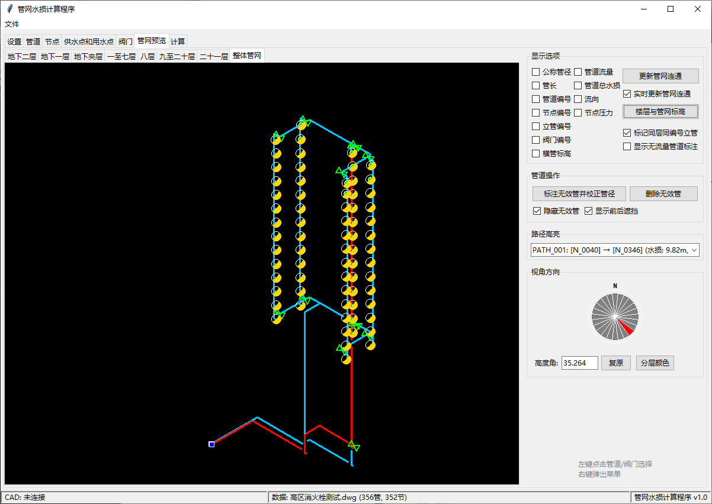
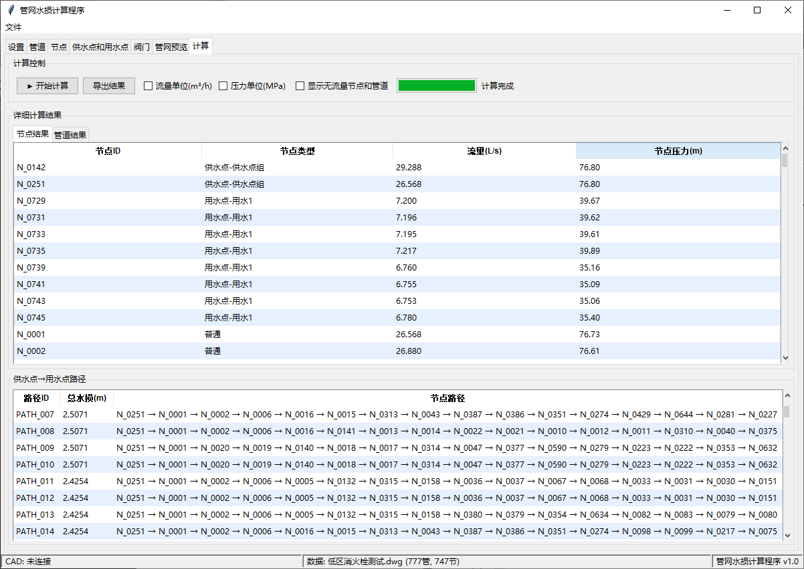
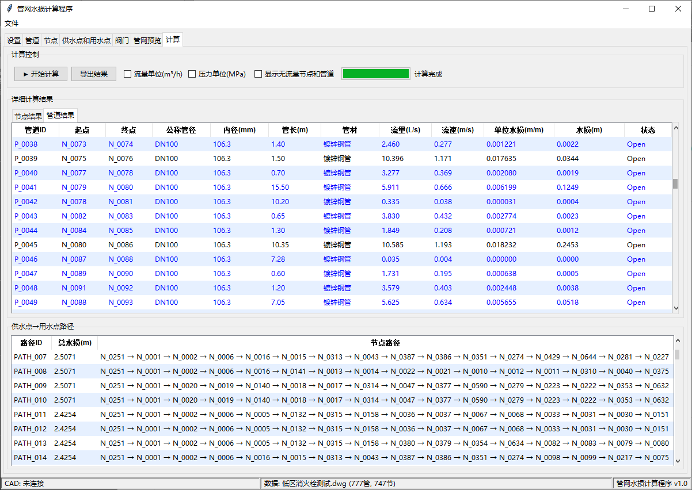
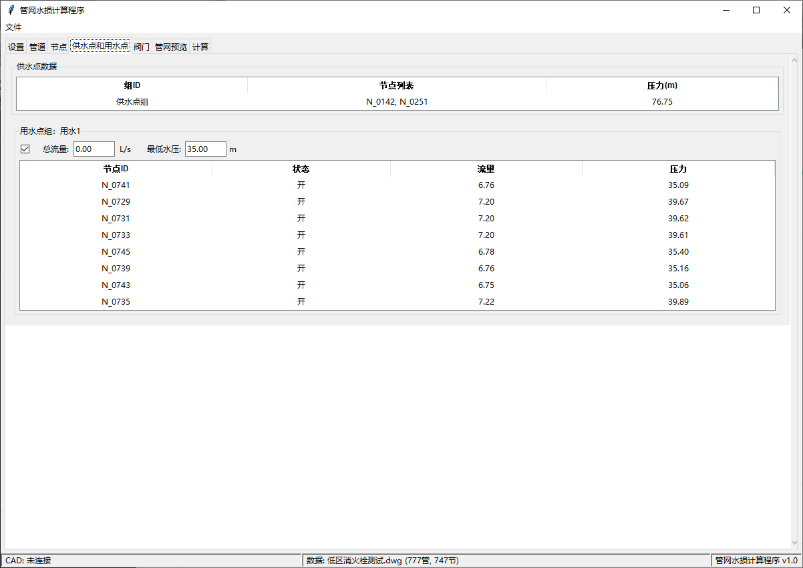
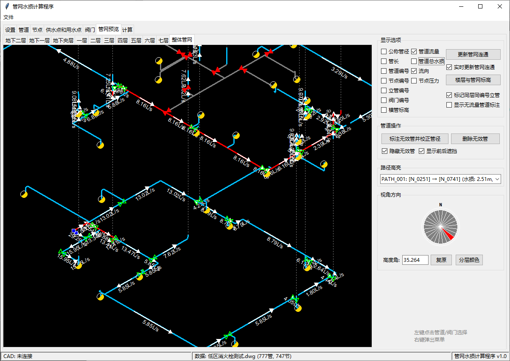
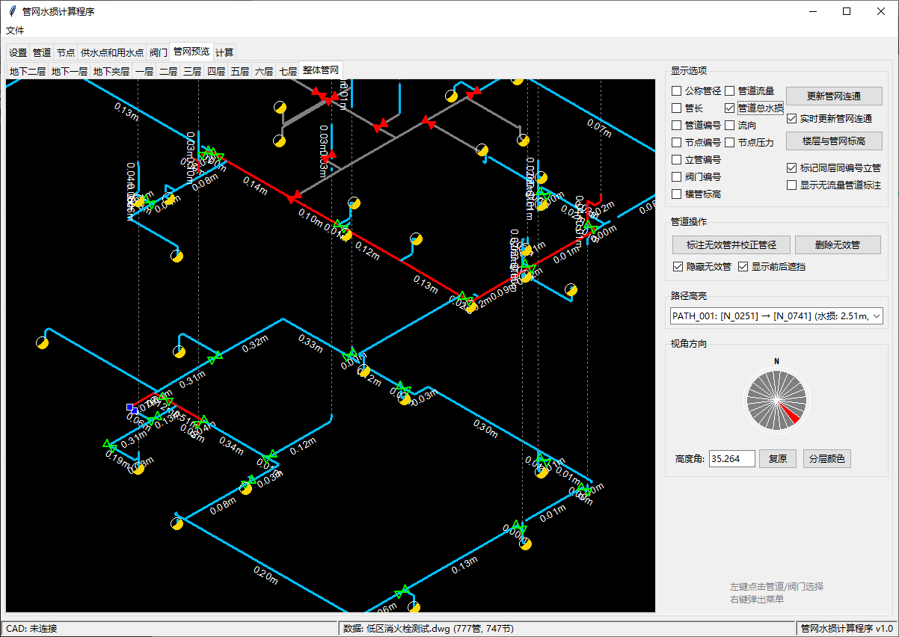

# 管网水损计算程序 使用说明

欢迎使用管网水损计算程序！本软件可以帮助您从CAD图纸中提取消防管网数据，计算消防管道的流量分配和水头损失。

本程序使用的计算库是WNTR（Water Network Tool for Resilience），是美国环保署（EPA）开发、面向供水管网韧性分析的开源Python库。因为个人自觉没有能力从零开发一个可用的计算模块，开发出来也不知是否可靠，还不如使用经过实践证明的成熟可靠的计算库。

使用前，请根据requirements.txt安装所需运行库。

这个软件主要想要解决的问题包括：

1、一个40L/s的复杂的室内消火栓管网，其中的流量和压力分布究竟如何？底部楼层的横向环网是否必须使用DN150？能否将常规设计为DN150的管道优化为DN100？

2、能否为设计师提供一个环状喷淋管网的免费计算功能？（尚未测试）

3、对于复杂消火栓管网，应该如何合理地设置阀门？能否合理地尽量少设置阀门，在管网中任意一管段检修的情况下，仍然采用DN100管径。这其实是一个管网优化问题。

4、对于栓口压力不低于0.25MPa和0.35MPa的规范要求，引入管处实际需要提供的流量和压力究竟是多少？能不能为设计师提供一个相对准确的引入点压力值？

---
## 0. 使用说明

### 0.1 cad的准备

一般推荐天正转t3后的dwg文件，尽量删掉不需要计算的内容，可保留建筑底图，但必须确保需要计算的管网的图层不被其它图元使用，程序是按照图层来读取图元的，所以用户应该采取措施保证需要计算的管网用的图层不被其它无关图元使用。

重要提醒：将与需要读取的图元无关的内容，比如建筑底图做成块，可以极大地加速读取速度。

本软件可以处理三种管网：室外消火栓、室内消火栓、喷淋。

室外消火栓管网最简单，开发并不完善。管网类型举例：从消防泵房到某建筑之间的消火栓管网，消防泵房两路出水，目的建筑有两三根消火栓引入管。或者从消防泵房或市政引入点到地块的室外消火栓。

室外消火栓管网计算只能是估算结果，不能作为精确结果，因为建筑的不同引入管的水压其实是不一样的，程序假定同一栋建筑的不同引入管的引入点的水压是一样的。室外消火栓也一样，各个室外消火栓的压力也会不同，所以这个管网类型的计算只能是估算结果。

室内消火栓管网，程序可以读取多层或单层室内消火栓管网。并计算管网的流量分配和各管段水损。此管网的计算结果是相对精确结果（说相对精确是因为局部水损并没有按照管件的当量长度来具体计算，而是乘了局部水损系数）。

单层室内消火栓管网不需要对齐xy坐标，但多层室内消火栓管网必须对齐xy坐标，这通过在cad中放置对齐点图块来实现，程序读取时，根据对齐点图块的坐标来对齐不同楼层的xy坐标。

对齐点图块位于软件目录的cadblock目录下，名为Floorbase.dwg，用户将每一层管网都用一个矩形框完全框住，并在矩形框左下角点插入对齐点图块。矩形框必须跟对齐点图块位于同一同层，不允许有其它图元使用它们的图层。

每一层的对齐点插入位置（矩形框的左下角点位置）可以在建筑坐标轴上对齐，比如都在A轴交1轴处。这样，每层管网就都获得了一个对齐点，程序就能对齐楼层了。

对齐点块有个参数，参数格式是：楼层名_楼面标高，比如；一层_0.00、十层_42.00。当多层共用一个平面时，各层楼面标高用&分隔，比如：三至五层_14.80&18.90&23.00。楼面标高的目的是给不同楼层的横干管管网赋予标高。

喷淋管网，程序可以计算单层最不利作用面积管网，理论上能计算环状管网和货架内喷淋管网，但尚未测试。此管网的计算结果是相对精确结果。

对于这三种管网，横管、立管圆和立管标注都必须有对应的图层，并在软件的设置页面输入图层名称。

供水点和用水点也可以在程序的管网预览页面中设置和删除，选择需要设置供水点或用水点的管道，右键选择相应菜单项。

不支持天正等专业软件格式，推荐用天正转t3导出的dwg文件，其它画图软件导出的dwg理论上也能识别，但未测试。

当绘制cad时，建议注意凡是代表管道的线段相连处，两条线段的端点尽量重合，程序设定了容差10mm（用户可修改），但尽量不要依赖容差。

对于多段线，程序会将之拆分为多个管道；一条线段端点落在另一条线段上时，程序会将相交点理解为三通；两条线段相交（相交点非两条线段的端点）时，程序会将相交点理解为四通。

需要注意，cad中因为图面识别需求，被上方管道遮挡而打断的管道，程序不会自动将被打断的管道连接，只会认为是不相连的两段管道。这个没办法，程序没这么智能。

程序设置页面的管理按钮可以修改管材C值，按钮下方可以选择管材。设置页面右方是颜色和管径对照表（此表内容可修改），用户如果愿意，可以在cad中将不同管径的线段颜色按此表设置，程序读取时就能直接获得管径。

如果嫌麻烦，也可以不进行赋予颜色的步骤，在程序的管网预览界面中修改管径。程序在读取cad时，会询问不符合颜色管径对照表的线段赋予什么管径，缺省DN100。

代表管道的线段可以是line或polyline。立管圆可以是circle或arc，因为天正转t3的图中，管道下翻的圆会被转化为arc，所以程序保留识别圆弧的能力。

程序设计时没有考虑弧形管道，不能确保能识别，也不能确保程序使用的wntr计算模块能识别，但用户可以尝试。

三种管网，我都提供了示例文件，大家可以参考，在软件目录下。室外消火栓：管网水损计算例图_t3.dwg；室内消火栓：低区消火栓测试.dwg、高区消火栓测试.dwg；喷淋：大项目喷淋_t3.dwg

### 0.2 读取cad前的参数设置

设置页面可选择管网类型，并设置CAD文件、管材、单位、图层、参数等。

一般使用步骤：

1、选择管网类型。

2、在cad路径输入框内输入CAD文件路径（也可以用浏览按钮选择）。

3、图层设置中分别输入管道图层、立管圆图层和立管标注图层。

4、设置单位与管材，建议画图单位选毫米、流量单位选L/s，压力单位选m。其它单位尚未充分测试。简单而言，此项不建议修改。容差是管线与管线相交端点之间、管线端点和立管圆中心等等允许的距离误差。

5、图块设置中输入对应dwg中的阀门块名、消火栓块名、喷头块名、对齐点块名，以及图对齐点块的属性字段名。

注：对齐点图块（Floorbase.dwg）在软件目录下的cadblock目录中，阀门、消火栓和喷淋图块看用户的dwg中的具体名字是什么，目前，三种图块都只支持一个块名。

供水点、用水点、喷头、阀门都可以在程序的管网预览页面中右键添加和删除，不需要在CAD中提前放置。

6、计算公式栏中是喷淋和消火栓的计算公式参数，一般保持默认值。喷头K值需要注意选择，也可以自行修改。

最高最低流速自行设置。当计算完成后，发现某些管道流速高于最高流速或低于最低流速，可以在计算页面的管道结果表中选校正管径（流速大于最高流速）或优化管径（流速小于最低流速）后重新计算。

7、点击“读取文件”按钮，读取cad数据。耐心等待程序读取完成。需要注意的是：读取的dwg文件必须在cad中保持为当前窗口。

8、读取有两个模式，分别是DXF模式和COM模式。当建筑底图打包成块时，dxf模式没有明显优势，所以缺省不选择DXF模式，但如果建筑底图没有打包成一个块，那dxf模式就有速度快的优势。DXF模式下实体属性读取与COM模式基本一致，但存在丢属性的可能，发现异常可去掉DXF读取复选框，使用COM模式读取，这个模式速度慢，但能读取完整。DXF模式需要安装ezdxf库（见requirements.txt）。

建筑底图没有打包成一个块的情况下，部分dwg的dxf导出模式会失败，dxf模式失败的情况下，程序会自动采用com模式。对于这种dwg，建议读取完成后先导出数据模型，以后就可以直接导入数据模型了，导入数据模型是最快的。

9、程序左上角有个叫文件的菜单项，里面有导入和导出功能，可以导出和导入数据模型。

10、软件目录下的exports目录下是四个管网模型样例，对应四个示例文件，可以用导入功能读取。

### 0.3 读取cad后的操作

1、管道页面、节点页面和阀门页面是程序读取的管道、节点和阀门列表，供数据查看用。

2、供水点和用水点页面很重要，读入cad后，需要先去管网预览页面放置供水点和用水点。

3、管网预览页面中，除了每层的平面管网预览标签外，还有个整体管网预览标签，相当于轴测系统图。

4、在管网预览页面，可以选择标注无效管并校正管径，室内消火栓管网模式中，这一步建议做，因为它能校正接消火栓的支管管径，当读取cad中，你将默认管径设为DN100时，这个按钮能将支管管径从DN100修正为DN65。然后，你可以选择隐藏无效管，也可以选择删除无效管。在室外消火栓管网和喷淋管网中，这一步不建议做。

5、页面右侧的显示选项可以自行摸索，缺省显示管径，部分选项复选框需要计算后才能勾选。

6、整体管网标签中，有个视角方向罗盘，选择视角方向的，还有个高度角，不建议修改，但如果你知道高度角什么意思，也可以修改，反正有复原按钮。

7、分层颜色按钮是将不同楼层的按不同颜色显示，方便区分管网。但有的时候效果并不突出。这时，你可以选择楼层与管网标高按钮，在楼层分离值中某些楼层输入分离的距离，选应用分离，就可以将管网拉开距离显示，这个功能不会影响计算结果。

8、楼层与管网标高表中的管网标高可以修改，管网标高缺省是上一层楼面标高-0.8m，最高层管网标高缺省是最高层楼面标高加3m，最高层管网的标高建议修改，其它楼层的管网标高自行决定是否需要修改，修改完后，记得点赋值。

9、在管网预览页面，选择一端为自由节点（指只连一根管道的点）的管道，点右键，可以放置或删除供水点或用水点。可以选择多个管道来放置（鼠标在空白处点右键，点选择集命令）。供水点就代表了管网的引入点，这里相当于水压的源头。用水点代表管网的出水点，这里代表水流的出口。

10、右键菜单放置用水点后，每个用水点都是一个独立组，保持选择它们的状态（实际上就是选择所在管道），选右键菜单的用水点编组，选择或输入一个组名，将这些用水点编成一组。比如计算室内消火栓管网，当室内消火栓用水量为40L/s时，可以将顶部两层的8个消火栓编为一组，以作为计算消火栓时的用水点组（实际上，根据样例文件的计算，40/s的流量，顶部两层只能开6个消火栓，8个消火栓总流量达到了60L/s）。又比如喷淋模式下，选择作用面积内的喷头（哪些喷头在作用面积内，请在cad中判断），添加用水点，然后将之变为一组，就可以计算作用面积内的喷淋流量。

11、供水点和用水点放置和编组完毕（供水点不需要编组）后，到供水点和用水点页面，根据你想要计算的方式，输入数据。

12、室外消火栓管网的计算是必须勾选要计算的用水点组，输入其总流量和供水点压力，然后去计算页面计算。

13、室内消火栓管网和喷淋管网，必须勾选要计算的用水点组，然后有两种计算模式，一种是只输入供水点压力，勾选的用水点组的总流量和最低水压保持为零，去计算页面点开始计算，这是正向计算。另一种是供水点压力和用水点组总流量保持为零，只输入用水点组的最低水压，去计算页面点开始计算，这是反向计算。这个最低水压是指用水点组中计算后水压最低的那个点的水压，比如计算喷淋管网时，输入10，就代表要计算最不利喷头工作压力10m时，管网的流量和压力分配。计算室内管网时，输入35，就代表要计算最不利消火栓栓口工作压力35m时，管网的流量和压力分配。

14、计算完成后，计算页面可以看到节点结果和管道结果表，还有路径表，路径表指供水点到用水点的某条路径，可以看到路径上的总水损。

15、计算页面中的结果不算直观，可以切换回管网预览页面查看，显示选项中此时可以查看管道流量、水损、流向和节点压力（未计算时，这四项都不可勾选）。

16、预览页面可以添加删除阀门。

17、对于不检修的环状消火栓管网，计算结果的意义不大，我们需要考虑的是检修情况。阀门设置完毕后，可以在某段管道上右键选此管检修，程序会自动关闭涉及到的阀门，踢除不能过水的管道。然后再计算，就可以知道某段管道检修时，整个管网的水压和流量分布了。计算完后，在检修管道群任一管道右键选不再检修，恢复管道状态。再去选别的管道检修和计算。

18、我们可以通过检修状态的计算来了解我们需要多少供水压力和管网需要的管径。目前程序没有能力自动设置管网各部分进入检修状态，然后自行计算，这个可能需要更复杂的程序设计。

19、对于喷淋管网，最新有个调整，程序读取cad后，自动在喷头所在位置创建向上的0.1m的短立管，程序根据设置页面的K值，查找程序根目录下的k_dn_map.json，然后赋予短立管管径，短立管顶部放置喷头，喷头K值就是设置页面的K值。就是说，喷淋系统初始读入时，都是上喷。用户可以在管网预览页面选择短立管和喷头，右键选修改喷头和短管，弹出对话框，可以修改喷头的K值，短立管管径和长度，以及上喷还是下喷。对话框中的复原是将上喷或下喷状态以外的属性恢复为缺省值，比如设置页面的K值，k_dn_map.json决定的短管管径，0.1m的短立管长度。

### 0.4 示例图片

## 1. 软件概述

本程序的主要功能：
- 从AutoCAD图纸中提取管道、节点、阀门、供水点、用水点、消火栓、立管等信息。
- 设置管材、单位、图层等参数。
- 支持三种计算模式：
  - **模式A（室外消防）**：传统需求驱动分析，使用虚拟节点，用水点总流量作为需求。
  - **模式B（室内消火栓/喷淋）**：供水点压力已知，迭代求解用水点需求（压力驱动）。
  - **模式C（室内消火栓/喷淋）**：用水点组最低水压已知，二分法搜索供水点压力。
- 显示计算结果（节点压力、管道流量、水损等），支持流速着色、排序、路径分析。
- 将计算结果（如管道流量、水损）反写到CAD图纸中。
- 提供管网预览功能，支持选择集、右键菜单、撤销/重做、管径实时调整、消火栓动态编辑、供水点/用水点动态添加/删除、分层颜色显示、整体管网等轴测视图及前后遮挡等。

> **注意**：程序使用 **WNTR** 作为水力计算核心，计算结果与 EPANET 保持一致。

---

## 2. 安装和启动

如果您拿到的是**打包好的程序**（例如一个文件夹），直接双击文件夹中的 `main.exe` 即可启动。

如果您是**从源代码运行**，需要安装Python环境并安装依赖库，然后运行 `main.py`。

启动后，您会看到主窗口，上方有多个标签页，底部有状态栏。

---

## 3. 主界面介绍

主窗口分为多个标签页：

- **设置**：配置CAD文件、管材、单位、图层、计算参数等。
- **管道**：查看从CAD提取的管道数据。
- **节点**：查看节点数据。
- **供水点和用水点**：设置供水点压力、用水点组总流量和最低水压。
- **阀门**：查看和修改阀门状态。
- **管网预览**：可视化显示管网和计算结果，支持丰富的交互操作（选择、框选、右键菜单、撤销、分层颜色、整体管网视图等）。
- **计算**：执行计算并查看结果。

底部状态栏显示CAD连接状态和数据加载状态。

---

## 4. 设置页面

点击 **“设置”** 标签，进行各项配置。

### 4.1 方案管理

- **当前方案**：您可以将一组设置保存为一个“方案”，方便以后切换。  
  右侧有“保存”、“更新”、“删除”按钮。
  - **保存**：将当前设置保存为一个**新方案**（会弹出对话框让您输入方案名）。
  - **更新**：将当前设置保存到**当前选中的方案**中。
  - **删除**：删除当前选中的方案（默认方案不能删除）。

> 提示：每次修改设置后，记得点击“更新”或“保存”以保留您的设置。

### 4.2 CAD文件设置

- **CAD文件路径**：点击“浏览”按钮，选择您的CAD图纸文件（支持 `.dwg` 和 `.dxf`）。选择后，路径会显示在输入框中。

- **预处理**复选框：勾选后，程序会对提取的管道进行预处理（多段线拆分和跨线分割），有助于提高节点识别的准确性。

- **读取CAD数据**：点击此按钮，程序会连接AutoCAD并提取图纸中的管道、节点等信息。读取过程中，按钮会变灰，状态文字会提示“正在读取…”。读取完成后会显示成功数量和状态。

- **DXF读取**复选框：默认勾选。勾选后，程序将通过导出临时DXF文件的方式快速读取CAD实体数据，速度更快（需安装ezdxf库）。若遇到某些图元（如自定义实体）读取不全的情况，可取消勾选，程序将使用传统的COM接口逐一遍历模型空间，速度较慢但兼容性更好。

> 注意：读取CAD数据前，请确保AutoCAD已经打开并打开了对应的图纸（程序会自动连接到当前打开的图纸）。

- **管网类型**：选择“室外消火栓”、“室内消火栓”或“喷淋”。室外消火栓对应模式A（使用虚拟节点），室内消火栓和喷淋对应模式B/C（压力驱动）。

- **局部水损比例**：沿程水损乘以该系数得到局部水损，总水损 = 沿程水损 × (1 + 局部水损比例)，默认0.3。

### 4.3 图层设置

- **横管图层**：输入代表管道的图层名（多个用英文逗号隔开，例如 `PIPE-消防, PIPE-喷淋`）。
- **立管图层**：输入代表立管的图层名（如 `VPIPE-消防`），程序会提取圆或圆弧作为立管。
- **立管标注图层**：输入立管引出标注所在的图层（如 `DIM_消防`），程序会自动匹配标注文字（如“PL-1 DN100”）。

下方会显示历史图层，点击历史图层可以直接添加到输入框。

### 4.4 单位与管材设置

- **画图单位**：您的CAD图纸使用的长度单位（毫米、厘米、米）。程序会根据此单位转换长度。
- **流量单位**：计算时希望使用的流量单位（L/s 或 m³/h）。
- **压力单位**：计算时希望使用的压力单位（m 或 MPa）。
- **匹配容差(mm)**：当阀门、供水点等靠近管道时，超过此距离将不被认为连接。一般保持默认10.0即可。
- **管材类型**：选择您使用的管材（如镀锌钢管、K9球墨铸铁管等）。
- **管理**按钮：可以新增、修改、删除管材（一般用户不需要操作）。

### 4.5 颜色-管径对照表

右侧面板是“颜色-管径对照表”。这里定义了CAD中每种颜色对应什么管径和内径。

- 您可以双击单元格修改颜色代码、公称管径、内径。
- 双击最后一行的“✓”可以添加新行，双击“×”可以删除行。
- 所有修改在光标离开单元格时自动保存。

> 重要：您的CAD图纸中，建议用不同颜色区分管径；未定义颜色的管道，读取时会询问默认管径。

### 4.6 图块设置

这里设置阀门、消火栓、对齐点、喷头在CAD中的图块名称和相关属性字段，分为三列：

**第一列：阀门 + 消火栓**
- **阀门块名**：输入表示阀门的图块名称（默认 `valve`），阀门初始状态为 OPEN。
- **消火栓名**：输入表示消火栓的图块名称（默认 `hydrant`）。程序会将此图块识别为消火栓，无属性字段。

**第二列：对齐点**
- **对齐点块**：输入表示对齐点的图块名称（默认 `Floorbase`）。
- **属性字段**：对齐点块的属性字段名（默认 `Elevation`）。对齐点用于对齐各层管网。

**第三列：喷头**
- **喷头块名**：输入表示喷头的图块名称（喷淋模式使用，无默认值）。必须与CAD图中的喷头图块名称一致。

请确保您的CAD图纸中的图块名称与此处设置一致，否则无法正确提取。

### 4.7 计算公式与参数

- **喷头公式**：`q = (K·√(0.1·P))/60`，其中 `q` 为喷头流量(L/s)，`P` 为喷头压力(m)，`K` 为流量系数。
- **消火栓公式**：`Hxh = Ad·Ld·q² + q²/B + Hak`，其中 `Hxh` 为栓口压力(m)，`q` 为栓口流量(L/s)，`Ad` 为水带比阻，`Ld` 为水带长度(m)，`B` 为水枪特性系数，`Hak` 为栓口水损(m)。

可编辑参数：
- **喷头K**：可输入或选择（80/115/161/200/202/242/320/363），默认80。
- **水带比阻Ad**：默认0.00172。
- **水带长度Ld(m)**：默认25。
- **水枪特性B**：默认1.577。
- **栓口水损Hak(m)**：默认2.0。
- **最高流速(m/s)**：用于管径校正（流速过高时放大管径），默认5.0。
- **最低流速(m/s)**：用于管径优化（流速过低时缩小管径），默认1.0。

---

## 5. 加载CAD数据

在设置页面选择好CAD文件后，点击 **“读取CAD数据”** 按钮。

- 程序会连接到AutoCAD并开始提取数据。
- 等待一段时间后，状态栏会显示成功信息，例如“成功读取 120 条管道，80 个节点”。
- 如果失败，会提示错误信息。常见原因：AutoCAD未打开、图块名称不匹配、颜色未定义等。

成功加载后，其他标签页（管道、节点等）就会显示数据。加载完成后，如果图纸中有消火栓图块，程序会自动提取并关联到最近的节点。

---

## 6. 查看管道/节点/阀门数据

### 6.1 管道页面

点击 **“管道”** 标签，可以看到所有管道的列表，包括管段ID、起点、终点、管径、内径、长度、状态、类型（干管/支管）、管材等信息。

- **右键菜单**：在表格上右键，可以“导出为CSV”（保存为表格文件）、“反写管道ID到CAD”（把管道编号写到图纸中）、“刷新数据”。

### 6.2 节点页面

点击 **“节点”** 标签，显示所有节点信息，包括节点ID、状态、坐标、节点类型、连接的管道等。节点类型包括“普通”、“供水点-xxx”、“用水点-xxx”，以及消火栓关联的节点。

- 右键可以“反写节点ID到CAD”或“刷新”。

### 6.3 阀门页面

点击 **“阀门”** 标签，显示所有阀门信息。您可以**双击状态列**，在弹出的对话框中将阀门设为“OPEN”（开启）或“CLOSED”（关闭）。阀门状态会影响计算（关闭的阀门会使管道断开）。

- 右键可以“反写阀门ID到CAD”。

---

## 7. 消火栓操作

消火栓以图块形式存在于CAD图纸中，程序提取后可在预览页面看到（金色右下半圆）。

### 7.1 添加消火栓

在预览页面，右键点击**仅连接一根管道且不是供水点的节点**，选择“添加消火栓”，即可在该节点上创建一个消火栓（程序内部数据，不会自动写回CAD）。此操作不会自动改变管道管径，但您可以通过“改为消火栓支管”命令将关联管道设为DN65。

> 注意：添加消火栓的前提是节点仅连接一根管道，且不是供水点。

### 7.2 删除消火栓

右键点击已存在消火栓的节点（或关联管道），选择“删除消火栓”，即可移除该消火栓数据。

### 7.3 改为消火栓支管

右键点击管道，如果管道一端自由（仅连接此管道）且自由端不是供水点、无消火栓，可以选择“改为消火栓支管”。程序会将该管道管径设为DN65，类型设为“支管”，并在自由端节点自动添加消火栓。

### 7.4 消火栓与用水点组关联

消火栓可以作为用水点参与水力计算。您可以将一个或多个消火栓加入现有的用水点组，或新建一个用水点组。

- **加入现有组**：右键点击消火栓节点（或关联管道），选择“加入用水点组”，然后在子菜单中选择目标组。
- **移出组**：右键点击已属于某组的消火栓节点，选择“移出用水点组”。
- **编组新组**：通过选择集选中多个消火栓（可选择管道，视同选中其关联节点），然后在空白处右键，选择“消火栓编成用水点组”，输入新组名（默认“消火栓组”），即可创建一个包含这些消火栓的新用水点组。

加入用水点组后，该节点的类型会更新为“用水点-组名”，并出现在供水点和用水点页面，您可以为其设置是否参与计算、总流量、最低水压等。

### 7.5 供水点/用水点动态操作（预览页面）

在预览页面，右键点击**自由端节点（仅连接一根管道）**的关联管道，选择：
- **添加供水点**：在该自由端节点上创建一个供水点（加入公共供水组“供水点组”）。
- **添加用水点**：在该自由端节点上创建一个用水点（自动生成单点用水组）。
- **删除供水点/用水点**：移除已存在的点。
- **用水点编组**：将用水点移入同一组（弹出对话框选择或输入组名）。
- **用水点移出组**：将用水点从当前组移出，变成单点组。

以上操作均会实时更新供水/用水点页面和管线预览。

---

## 8. 设置供水点和用水点

点击 **“供水点和用水点”** 标签。

### 8.1 供水点

上方表格列出了所有供水点组（每个组可能包含多个节点）。您可以**双击压力列**直接修改供水压力（单位与设置页面一致）。

### 8.2 用水点

下方为每个用水点组（按属性分组）显示一个区域。每个组包含：

- 一个复选框：勾选表示该组**参与计算**。
- **总流量输入框**：输入该组的总用水量（单位与设置页面一致）。仅模式A（室外消防）使用。
- **最低水压输入框**：输入该组要求的最低水压（单位与设置页面一致）。仅模式C使用。
- 组内节点表格：显示每个节点的状态、流量、压力（计算后才会显示）。

**操作步骤：**
- 对于**模式A（室外消防）**：勾选需要计算的用水点组，并在总流量输入框中输入该组的总流量，**不输入最低水压**。
- 对于**模式B（室内消火栓或喷淋）**：勾选需要计算的用水点组，**只输入供水点压力**（在供水点表格中），总流量和最低水压留空。
- 对于**模式C（室内消火栓或喷淋）**：勾选需要计算的用水点组，**只输入最低水压**，供水点压力和总流量留空。

> 注意：输入框的值在光标离开后自动保存。单位切换时会自动更新显示。

---

## 9. 阀门设置

在阀门页面（或管网预览页面）可以修改阀门状态。阀门关闭会使相应的管道断开，影响水流路径。

- 在阀门页面**双击状态列**，选择“OPEN”或“CLOSED”。
- 在管网预览页面，右键点击阀门，可以打开/关闭或删除阀门。

---

## 10. 执行计算

### 10.1 计算类型选择

计算类型由设置页面的“管网类型”决定，无需在计算页面额外选择。

### 10.2 自动判断计算模式

点击 **“开始计算”** 按钮后，程序会根据您输入的供水点压力、用水点组总流量和最低水压自动判断采用哪种模式：

- **模式A**：当存在供水点压力且至少有一个用水点组的总流量大于0时触发。
- **模式B**：当存在供水点压力，且所有用水点组的总流量和最低水压均为0时触发。此时必须至少勾选一个用水点组。
- **模式C**：当至少有一个用水点组的最低水压大于0，且没有供水点压力时触发。

如果输入不符合以上任一模式，程序会弹出警告。

### 10.3 计算过程

- **模式A**：程序生成包含虚拟节点的INP文件，调用WNTR进行一次计算。
- **模式B**：程序在给定供水点压力下，迭代求解用水点需求（消火栓/喷头公式），直到收敛。
- **模式C**：程序采用二分法搜索供水点压力，使最不利用水点压力达到最低水压要求（取高于目标的最小供水点压力）。二分过程中会多次调用WNTR。

计算过程中，进度条和状态标签会显示当前进度。计算完成后，下方三个表格（节点结果、管道结果、路径结果）会自动填充数据。

> **提示**：结果表格中会自动过滤掉虚拟节点（如`RESERVOIR`）和虚拟管道（如`VP_S*`），只显示实际管网元素。

### 10.4 查看结果

- **节点结果**：显示节点流量、实际压力（考虑了上游水损）。用水点节点如果未被勾选则不显示。压力最小的行会以红色加粗显示。
- **管道结果**：显示流量、流速（三位小数）、单位水损、水损（含沿程和局部水损）。流速超过最高流速的管道显示红色，低于最低流速的显示蓝色。支持点击列头排序。

- **显示无流量节点和管道**复选框：默认勾选后，表格中不显示流量为零的节点和管道，便于聚焦于有流量数据；取消勾选则显示全部。
- **路径结果**：显示从每个供水点到每个用水点的路径（基于实际流向）。点击列头可在“节点路径”和“管道路径”之间切换显示。支持隔行变色。

### 10.5 单位切换

在计算页面的控制面板中，您可以通过复选框切换流量单位（L/s 或 m³/h）和压力单位（m 或 MPa）。切换后表格数据会自动转换。

---

## 11. 管径校正与优化（计算页面）

在管道结果表格上**右键**，选择：

- **校正管径（全管网）**：将所有流速超过“最高流速”的管道管径放大一级（跳过支管）。
- **优化管径（全管网）**：将所有流速低于“最低流速”的管道管径缩小一级（室内消火栓模式下缩小至DN65需满足自由端条件，跳过支管）。

操作后，管道页面和预览页面的管径、类型会自动更新，但计算结果需重新点击“开始计算”以反映新管径。

---

## 12. 反写结果到CAD

在管道结果表格上**右键**，选择 **“反写管道ID和水损到CAD”**，程序会将以下信息写回CAD图纸中：

- 每根管道旁边会添加两行文字：
  - 第一行：`管道ID_流量_总水损`（例如 `P_0001_5.2L/s_0.34m`）
  - 第二行：一个箭头，表示水流方向（箭头方向根据流量正负确定）

> 提示：反写前请确保AutoCAD中已打开对应的图纸，且当前图层可写。

---

## 13. 管网预览

点击 **“管网预览”** 标签，可以以图形方式查看整个管网，并进行丰富的交互操作。

### 13.1 基本操作

- **缩放**：使用鼠标滚轮。
- **平移**：按住鼠标中键拖动。
- **选择管道**：
  - **单击**：左键点击某管道，将其加入选择集（可连续单击，逐个添加）。
  - **框选**：在空白处按住左键拖动，出现白色虚线矩形框，松开后矩形内的所有管道均被加入选择集。
  - **Ctrl+单击**：按住Ctrl键点击已选中的管道，将其从选择集中移除。
  - **Ctrl+框选**：按住Ctrl键框选一组管道，将这些管道从选择集中移除。
  - **Esc键**：清空整个选择集。
- **选择阀门**：左键点击阀门，会清空管道选择集，并高亮阀门（黄色）。

### 13.2 显示选项

右侧控制面板可以控制显示内容：
- **公称管径、管长、管道编号、节点编号、立管编号、阀门编号、横管标高**：勾选后会在管道/节点旁显示对应信息。
- **管道流量、管道总水损、流向箭头、节点压力**：仅在计算完成后才变为可用。勾选后，画布上的管道/节点旁会显示对应的数值和箭头。
- **显示无流量管道标注**：勾选后，流量为零的管道也会显示标注（默认不显示）。
- **实时更新**：勾选时，修改阀门状态后会自动更新连通性（可到达的管道用亮蓝色显示，不可达的为灰色）；不勾选时需要手动点击“更新管网”按钮。

### 13.3 右键菜单

根据点击位置不同，弹出不同的菜单。

#### 右键点击管道

- **添加阀门**：如果该管道上无阀门，可添加一个阀门（默认开启）。
- **关闭阀门/打开阀门/删除阀门**：如果管道上已有阀门，可进行相应操作。
- **添加消火栓**：如果管道的一端节点仅连接此管道，且不是供水点，可在此节点上添加消火栓。
- **删除消火栓**：如果管道某端节点有消火栓，可删除该消火栓。
- **放大管径**：将当前管道管径放大一级（根据系统类型和当前管材的可用管径列表）。
- **缩小管径**：将当前管道管径缩小一级（室内消火栓模式下，缩小到DN65需满足自由端条件）。
- **改为消火栓支管**：将当前管道改为DN65支管，并在自由端节点添加消火栓（需满足条件）。
- **缩小支管链到DN65**：室内消火栓模式下，将包含当前管道的整个支管链（从自由端消火栓到分支点）上的所有管道一次性缩小到DN65。此操作仅当管道属于可缩小的支管链时显示。
- **使无效/使有效**：标记管道无效（紫色）或恢复有效。
- **删除管道**：移除该管道。
- **添加供水点/添加用水点/删除供水点/删除用水点**：在自由端节点上动态添加或删除供水/用水点。
- **用水点编组/移出组**：对自由端上的用水点进行编组或移出组。
- **加入用水点组/移出用水点组**：针对有消火栓的节点，将其加入或移出用水点组。
- **此管检修**：将当前管道及其上下游受阀门影响的区域隔离（关闭区域内所有管道和阀门），模拟检修工况。再次右键点击检修区内的任一管道，菜单会变为“不再检修”，点击可恢复原状。

#### 右键点击喷头短管

在喷淋模式下，右键点击选中了喷头短管（连接喷头图块的立管），菜单会额外显示：

- **编辑喷头短管**：打开喷头短管编辑对话框，可批量修改所选喷头短管的 K 值、管径、长度和方向（向上/向下）。

#### 右键点击阀门

- **关闭阀门/打开阀门**：切换阀门状态。
- **删除阀门**：移除阀门。

#### 右键点击节点（带消火栓）

- **加入用水点组**：如果该节点有消火栓且尚未加入任何用水点组，会弹出子菜单列出所有现有用水点组，选择后节点加入该组。
- **移出用水点组**：如果节点已属于某组，可将其移出。

#### 右键点击空白处（且选择集非空）

- **放大管径（选择集）**：将选择集中所有管道管径放大一级。
- **缩小管径（选择集）**：将选择集中所有管道管径缩小一级。
- **改为消火栓支管（选择集）**：将选择集中所有满足条件的管道改为支管（同时自动添加消火栓）。
- **使无效（选择集）/使有效（选择集）**：批量修改管道有效性。
- **删除（选择集）**：批量删除选中的管道。
- **消火栓编成用水点组**：将选择集中与消火栓关联的所有节点（通过管道关联）组成一个新的用水点组，弹出对话框输入组名。
- **添加供水点（选择集）/添加用水点（选择集）/删除供水点（选择集）/删除用水点（选择集）**：批量操作自由端节点上的点。
- **用水点编组（选择集）/移出组（选择集）**：批量编组或移出。

### 13.4 撤销与重做

在执行管径调整、阀门操作、消火栓添加/删除、用水点组变更、管道有效性修改、删除等操作后，您可以使用 **Ctrl+Z** 撤销最近的操作（最多40步）。撤销后，相关数据会回滚，并刷新所有页面。撤销的数据会被压入重做栈，但当前版本暂未提供重做的快捷键或菜单入口。

### 13.5 立管显示

如果设置了立管图层和标注图层，预览页面会以青色圆圈显示立管，并自动匹配引出标注文字（如“PL-1 DN100”），显示在立管旁边。立管会自动匹配到最近的横管端点或打断横管，确保管网连通。

### 13.6 路径高亮

在计算完成后，路径结果会出现在右侧的“路径高亮”下拉框中。选择一条路径，对应的管道和节点会在画面上高亮显示（管道红色，节点红色圆点）。

### 13.7 整体管网视图

切换到“整体管网”标签页，可以查看整个管网的等轴测投影视图，支持：
- **罗盘**：点击不同扇区切换24个固定观察方向（15°扇区，红色高亮当前方向）。
- **高度角**：输入0~90°（与水平面夹角），默认35.264°（标准等轴测视角）。
- **前后遮挡**：勾选“显示前后遮挡”（位于右侧控制面板的“管道操作”栏内，默认开启），后方管线在交叉处会断开，产生立体层次感。

### 13.8 分层颜色

在整体管网视图下，勾选“分层颜色”复选框（位于高度角输入框旁的按钮），可按楼层标高从低到高循环使用颜色表为横管着色。点击“分层颜色”按钮可打开编辑对话框：
- 新增/删除颜色行。
- 双击编辑颜色名称、RGB值。
- 拖拽排序（颜色行可拖拽到新位置）。
- 启用/禁用复选框实时控制。
- 图例自动绘制在画布左下角。

### 13.9 视图保持

执行管径调整、改为支管等操作时，画面**不会自动缩放**，保持当前视图不变，方便您观察局部修改。阀门操作也不缩放。只有切换标签页或手动点击“更新管网连通”按钮才会重新居中。

### 13.10 标注无效管与删除无效管

在右侧控制面板的“管道操作”区域：
- **标注无效管并校正管径**：标注无效立管后，自动校正管径（仅室内消火栓模式）。
- **删除无效管**：删除所有标记为无效的管道和孤立节点（弹出确认对话框）。
- **隐藏无效管**：勾选后，无效管道在画布上不显示，但仍存在于数据中。

### 13.11 楼层与管网标高表

点击右侧控制面板的 **“楼层与管网标高”** 按钮，打开编辑对话框。此对话框用于：

- **调整管网标高**：修改每层管网的Z坐标（管道中心线高度），影响节点Z值和管道长度计算。
- **楼层分离显示**：为各楼层设置垂直分离值，仅在整体管网预览中拉开楼层间距，便于观察（**不影响计算结果**）。
- **添加/删除楼层**：通过右键菜单可在表格中插入新行或删除无管道的楼层。

#### 对话框界面说明

- **管道与上层楼面标高差(m)**：非顶层管网的标高 = 上一层楼面标高 − 此差值。修改后自动重算管网标高。
- **表格列**：楼层名（不可编辑）、楼面标高(m)、管网标高(m)、楼层分离值(m)。
  - 双击 **管网标高** 单元格可直接手动输入，程序将不再自动计算该行（标记为手动覆盖）。
  - 双击 **楼层分离值** 单元格可输入整数（单位：米），最低楼层强制为0。
- **右键菜单**：在表格上右键可插入新行（上方/下方）或删除选中行（仅当该楼层无管道时允许）。

#### 底部按钮功能

- **应用分离**：将表格中每行的分离值保存到内存，并在整体管网视图中按指定值垂直拉开各楼层（**仅视觉效果**）。再次点击可更新分离值。
- **清除分离**：将所有分离值归零，恢复无分离显示。
- **赋值**：将表格中的楼面标高和管网标高真正写入数据模型（重新计算节点Z坐标、管道长度），并关闭对话框。此操作会**永久改变模型**，请谨慎使用。
- **取消**：关闭对话框，放弃所有未赋值的修改。

> 提示：分离值功能专门用于解决多层管网在整体视图下管线重叠的问题，不会影响水力计算结果。

---

## 14. 保存和导出

### 14.1 保存方案

在设置页面，点击 **“保存”** 按钮，输入新方案名，可以将当前设置保存为一个方案，方便以后直接使用。

### 14.2 导出数据

- 在管道、节点、供水点/用水点页面，右键可以导出为CSV文件（可以用Excel打开）。
- 在计算页面，点击 **“导出结果”** 按钮，可以将所有计算结果（节点、管道、路径）导出为JSON或Excel文件。

---

## 15. 常见问题

### Q1: 读取CAD数据时提示“pyautocad未安装”或无法连接CAD？

A: 请确保您已经安装了AutoCAD，并且当前打开了需要计算的图纸。如果仍不行，可以尝试以管理员身份运行本程序。

### Q2: 读取后管道数量为0，怎么办？

A: 可能原因：
- 图层名称设置不正确，请确认输入了正确的管道图层。
- 管道颜色未在颜色-管径对照表中定义。请检查图纸中管道的颜色，并在设置页面的颜色表中添加对应颜色。
- 管道是用其他实体类型画的（例如圆、圆弧），目前只支持多段线和直线。

### Q3: 供水点/用水点提取不到？

A: 请检查设置页面中的图块名称和属性字段是否与CAD中的一致。属性字段通常是图块的属性标签，例如“GroupID”。

### Q4: 计算失败，提示“WNTR计算错误”？

A: 可能原因：
- 管网不连通（例如所有阀门关闭、没有供水点或用水点）。
- 数据异常（如管道长度为0）。请检查CAD数据。

### Q5: 反写结果到CAD时没有反应？

A: 请确保AutoCAD中当前文档处于活动状态，并且没有被锁定。可以尝试在CAD中切换到模型空间再试。

### Q6: 如何卸载软件？

A: 如果是打包版，直接删除整个文件夹即可。如果是源码版，删除代码文件夹。

### Q7: 模式B或模式C计算失败，提示“二分法未找到满足要求的供水点压力”怎么办？

A: 可能原因：
- 您输入的用水点组最低水压过高，导致即使供水点压力很大也无法满足。
- 管网本身存在连通性问题（如阀门全部关闭），导致水无法流到某些用水点。
- 消火栓或喷淋参数设置不合理（如Hak过大导致流量为0）。

建议先检查管网连通性和参数设置，适当降低最低水压要求再试。

### Q8: 为什么模式B/C计算后，节点结果中没有显示我勾选的用水点？

A: 请确认该用水点确实与供水点连通，且阀门状态正确。程序在生成有向图时，如果水流无法到达该节点，则不会在结果中出现。可以切换到预览页面查看管网连通性（开启“实时更新”后，可到达的管道会显示为亮色）。

### Q9: 预览界面的流量、水损复选框在模式B/C计算后仍然不可用？

A: 请检查是否在计算页面成功完成了计算，并且日志中显示“已调用预览页面的 set_calculation_results”。如果仍不可用，可能是由于计算结果中不包含任何实际管道（例如所有管道被虚拟管道替代），请检查INP文件是否正确生成。

### Q10: 为什么消火栓无法添加到某个节点？

A: 可能原因：
- 该节点已有关联的消火栓。
- 节点是供水点（供水点不能添加消火栓）。
- 节点连接的管道数不为1（只有末端节点才能添加消火栓）。

### Q11: 为什么缩小管径时不能缩小到DN65？

A: 在室内消火栓模式下，只有自由端节点（仅连接一根管道）的管道才能缩小到DN65（作为支管）。其他干管最小只能缩小到DN100。

### Q12: 立管无法正确匹配？

A: 请确保：
- 在设置页面正确填写了“立管图层”和“立管标注图层”。
- 立管实体为圆（AcDbCircle）或圆弧（AcDbArc），且位于立管图层。
- 引出标注为直线（AcDbLine）位于标注图层，文字为多行或单行文本（AcDbText），且包含“DN”字样。
- 容差设置合理（默认10mm）。

### Q13: 为什么整体管网视图中有些管线断开了？

A: 这是开启“显示前后遮挡”的效果，前方管线会遮挡后方管线，使立体感更强。可取消勾选关闭。

### Q14: 如何调整分层颜色的顺序？

A: 在分层颜色编辑对话框中，直接拖拽颜色行即可调整顺序，颜色按顺序循环分配给楼层（从低标高开始）。

### Q15: 动态添加了供水点/用水点后，如何参与计算？

A: 新添加的点会自动出现在供水/用水点页面，需要在供水/用水点页面设置压力或勾选并设置参数后，再执行计算。

### Q16: 整体管网视角下可以旋转角度吗？

A: 目前仅支持通过罗盘选择24个固定方向和修改高度角，无法自由旋转。

---

如果您在使用过程中遇到其他问题，可以查看程序目录下的 `app.log` 日志文件，并丢给AI，或联系软件开发者。建议优先问AI，不得已再找作者这个三脚猫半吊子。祝您使用愉快！